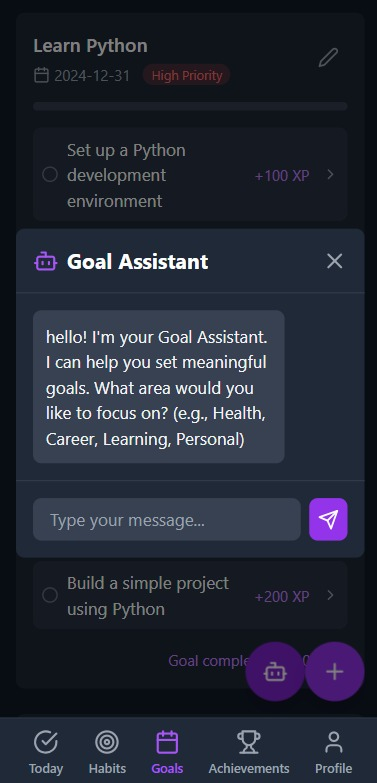
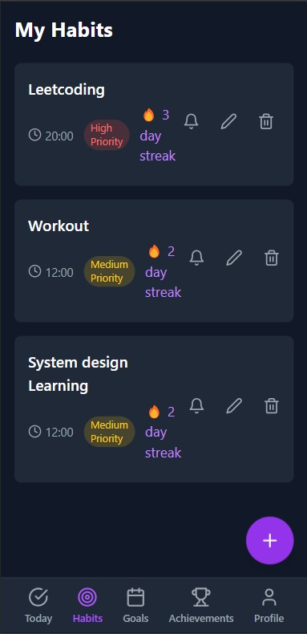
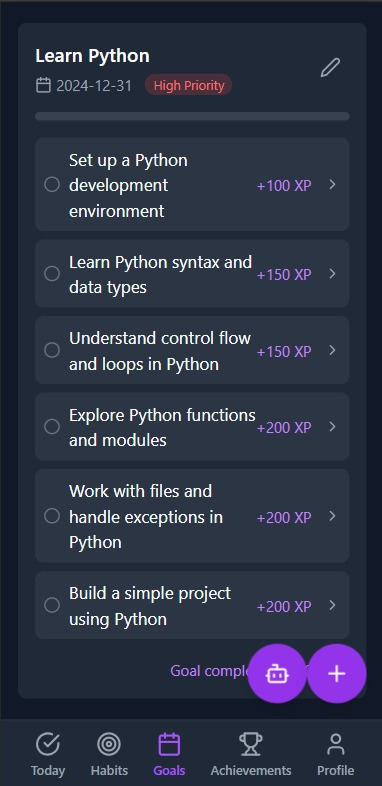
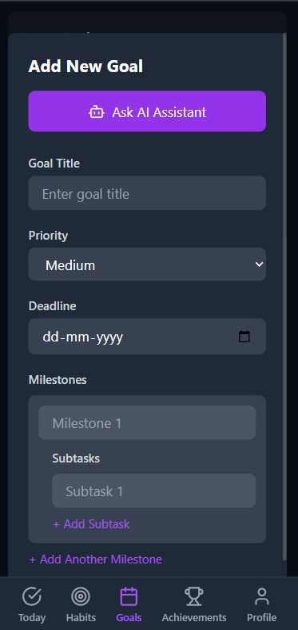
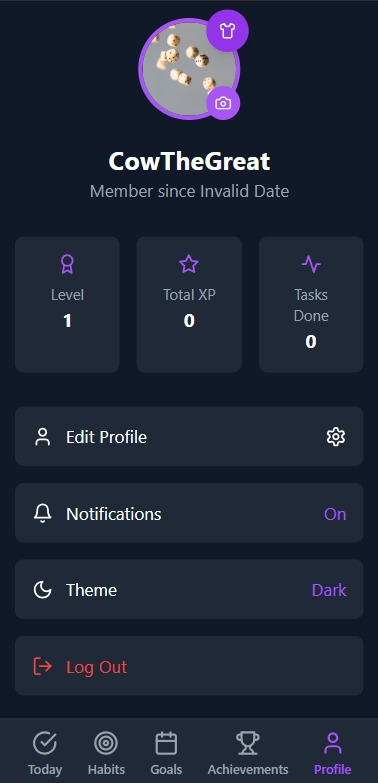
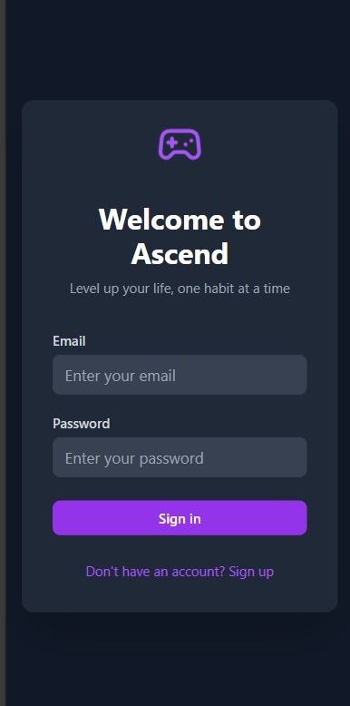

# ASCEND - AI-Driven Skill Development Platform


**ASCEND** is a lightweight, accessible, and ethical skill development platform powered by AI. It's designed to help individuals acquire and track new skills, supporting career growth and professional development.

---

## 🎯 Purpose

ASCEND empowers users to develop new skills, track learning progress, and receive AI driven guidance, while respecting real-world constraints such as:

- Low-bandwidth connectivity
- Basic device access (feature/shared phones)
- Limited digital literacy
- Sparse data and technical support
- Need for privacy, transparency, and fairness

---

## 🛠️ Features

### AI-Powered Skill Recommendations


Personalized skill development recommendations using local AI (Llama via Ollama), tailored to your career goals and interests.

### Skill Tracking & Progress


Track daily practice sessions, maintain learning streaks, and monitor skill development progress.

### Goal Management


Set and manage skill development goals with clear milestones and progress tracking.

### Custom Skill Development Plans


Create personalized skill development plans with specific learning objectives and timelines.

### User Profile & Progress


Monitor your skill development journey and track achievements.

### Secure Access


Secure authentication to protect your learning progress and personal data.

---

## 🎓 Skill Development Focus Areas

- **Technical Skills**: Programming, data analysis, digital tools
- **Professional Skills**: Communication, leadership, project management
- **Creative Skills**: Design, writing, content creation
- **Language Learning**: Vocabulary building, grammar practice, conversation skills
- **Certification Prep**: Study tracking, exam preparation, practice tests

---

## ⚙ Tech Stack

### Frontend
- React + TypeScript
- Tailwind CSS
- Context API
- Progressive Web App (PWA)

### Backend
- FastAPI (Python)
- Ollama (LLaMa3.1 models)
- Local JSON-based storage (MangoDB future implementation)

---

## 🚀 Getting Started

### Prerequisites

- Node.js (v16+)
- Python (v3.8+)
- Ollama (installed and running locally)
- Docker (deployment)

### Installation

```bash
# Clone
git clone https://github.com/yourusername/ascend.git
cd ascend

# Frontend
cd frontend
npm install
npm run dev

# Backend
cd ../backend
pip install -r requirements.txt
uvicorn app:app --reload
```

### Ollama Setup

```bash
ollama pull llama3.1
```

---

## 📦 Docker Deployment

```bash
docker-compose build
docker-compose up
```

---

## 📁 Project Structure

```
ascend/
├── frontend/              # React app
│   └── src/
│       ├── components/
│       ├── context/
│       └── pages/
├── backend/               # FastAPI app
│   ├── app.py
│   ├── models.py
│   ├── utils.py
│   └── config.py
└── README.md
```

---

## 🔐 Ethics & Privacy

- **Data Privacy**: User data stays local or shared only with consent
- **Transparency**: Users understand how AI makes skill recommendations
- **Bias Mitigation**: Regular checks to ensure fairness across user types
- **Sustainability**: Designed for community ownership and long-term impact